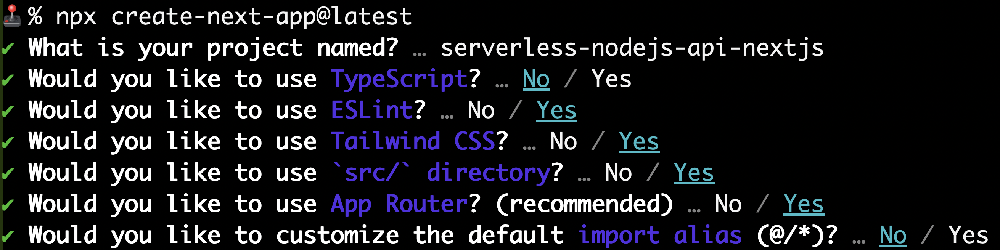

# Example App Using the Serverless Node.js Api

This is a Next.js application designed to:

- Be Deployed on Vercel.com
- Use a pre-existing backend/API instead of Next.js's API (although you can use both)


The API we will use is what we created in the Serverless Node.js API course [repo](https://github.com/codingforentrepreneurs/serverless-nodejs-api). The Serverless Node.js API is deployed on AWS Lambda via the [Serverless framework](https://github.com/serverless/serverless) and [Neon's Serverless Postgres Database](https://neon.tech) service.

To creat this app, we just ran:



Then we added:

- `vercel.json`

With the contents:

```json
{
    "rewrites": [
        { 
            "source": "/api/leads",
            "destination": "https://my-api-example.com/api/leads"
        }
    ]
}
```